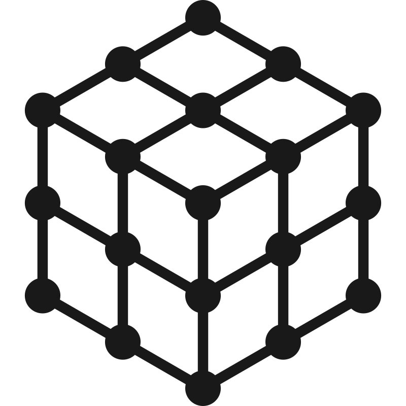

<h1>

Threefy
</h1>


## Overview
**Threefy** is a lightweight JavaScript library that brings [**three.js**](https://threejs.org/) into [**React**](https://react.dev/) as first-class declarative components. Describe a scene the way you describe a UI — as a tree of elements with props — and threefy handles the imperative object graph, the render loop, and the disposal for you.

The entire library ships as a single ES module — **144 kB, about 41 kB gzipped** — with no bundled dependencies: react and three.js stay external, so you keep full control over your own versions and never pay for a duplicate copy of three.js.

## What's new in 2.0 — WebGPU

Threefy 2.0 is a ground-up migration to **`WebGPURenderer`**, the modern rendering engine of three.js. This is not a compatibility shim — the whole library was rewritten against the WebGPU stack, so the renderer's capabilities are available to you directly and idiomatically.

- **Modern GPU pipeline.** Rendering runs on WebGPU, with its explicit pipeline state, lower CPU driver overhead, and support for compute-based workloads on the GPU.
- **Automatic WebGL 2 fallback.** `WebGPURenderer` transparently falls back to a WebGL 2 backend on browsers or devices without WebGPU. The same application code runs everywhere — you write it once.
- **Node materials, as JSX.** The full node material family is registered as elements — `<meshStandardNodeMaterial/>`, `<meshPhysicalNodeMaterial/>`, `<spriteNodeMaterial/>` and more — so you can attach TSL nodes (`colorNode`, `positionNode`, `normalNode`, `fragmentNode`, …) straight from your component tree.
- **TSL instead of GLSL.** Shading is authored in **Three.js Shading Language**, a composable JavaScript API that compiles to WGSL on WebGPU and to GLSL on the WebGL 2 fallback. One shader, both backends.
- **A rebuilt post-processing pipeline.** Effects are driven by the node-based `RenderPipeline`. Bloom, ground-truth ambient occlusion, outline, depth of field, FXAA, dot-screen, RGB shift, glitch, anaglyph, parallax-barrier, stereo and ASCII are all provided as drop-in passes and effects.
- **Instancing that scales.** `InstancedObject` renders a whole multi-mesh model as instances that share a single matrix and color buffer, and `InstancedSkinnedMesh` gives every instance its own animated skeleton through a TSL skinning path.

Because threefy imports `three/webgpu` directly, no bundler aliases or build configuration are required on your side.

## Requirements
| Package | Version |
| --- | --- |
| `react` / `react-dom` | `>= 19.1` |
| `three` | `>= 0.185` |

## Installation
Install threefy alongside its peer dependencies:
```sh
npm install threefy three react react-dom
```
Then import it into your React project:
```js
import * as Threefy from 'threefy'
```
That's it — no renderer setup, no configuration. You're ready to build.

## Basic Usage

The first example creates a 3D scene from elements; the second updates a mesh through ordinary React state and hooks. If no camera or scene is declared — as in the second example — threefy inserts sensible defaults for you. All 3D elements must live inside a **`ThreeCanvas`**.

#### 1) Creating 3D elements
```jsx
import { createRoot } from 'react-dom/client'
import * as Threefy from 'threefy'

createRoot(document.getElementById('root')).render(
  <Threefy.ThreeCanvas>
    <perspectiveCamera args={[ 60, 1.23, 0.1, 1000 ]} position={[ 0, 0, 50 ]}/>
    <scene>
      <ambientLight args={[ 0xffffff, 0.5 ]}/>
      <directionalLight args={[ 0xffffff, 1 ]} position={[ 1, 2, 3 ]}/>
      <mesh>
        <boxGeometry args={[ 20, 20, 20 ]}/>
        <meshStandardMaterial color={'yellow'}/>
      </mesh>
    </scene>
  </Threefy.ThreeCanvas>
)
```

#### 2) Updating a created 3D element
```jsx
import { useRef, useState } from 'react'
import { createRoot } from 'react-dom/client'
import { ThreeCanvas, useFrame } from 'threefy'

const DemoHoverClick = () =>
{
  const ref = useRef(null)
  const [ index, setIndex ] = useState( 0 )
  const [ hovered, setHovered ] = useState( false )

  const sizes = [ 7, 10, 13, 16 ]
  const colors = [ 'red', 'green', 'blue', 'yellow' ]
  const size = sizes[ index ]
  const color = hovered ? colors[ index ] : 'white'

  useFrame( t => { if( ref.current ) ref.current.rotation.y = t } )

  return (
    <mesh
      ref={ref}
      onClick={() => setIndex( (index + 1) % 4 )}
      onPointerOver={() => setHovered(true)}
      onPointerOut={() => setHovered(false)}
    >
      <boxGeometry args={[size, size, size]}/>
      <meshStandardMaterial color={color}/>
    </mesh>
  )
}

createRoot(document.getElementById('root')).render(
  <ThreeCanvas>
    <threePointLighting/>
    <DemoHoverClick/>
  </ThreeCanvas>
)
```

#### 3) Shading with TSL
Node materials accept TSL nodes as props, so custom shading stays inside your component tree — no string shaders, no `onBeforeCompile`.

```jsx
import { createRoot } from 'react-dom/client'
import { ThreeCanvas } from 'threefy'
import { positionLocal, sin, time, vec3 } from 'three/tsl'

const PulsingBox = () => (
  <mesh>
    <boxGeometry args={[ 20, 20, 20 ]}/>
    <meshStandardNodeMaterial
      colorNode={vec3( sin( time ).mul(0.5).add(0.5), 0.4, 1 )}
      positionNode={positionLocal.mul( sin( time ).mul(0.05).add(1) )}
    />
  </mesh>
)

createRoot(document.getElementById('root')).render(
  <ThreeCanvas>
    <threePointLighting/>
    <PulsingBox/>
  </ThreeCanvas>
)
```

## Features
- **Seamless React integration.** Scenes are component trees. Props drive the three.js object graph, refs give you the real objects, and unmounting cleans up after itself.
- **Powered by the three.js WebGPU renderer.** The modern rendering path, with automatic WebGL 2 fallback for wide reach.
- **Concise, readable syntax.** Elements, props and hooks replace boilerplate setup for geometries, materials, lights, controls and animation.
- **Batteries included.** Loaders for the common 3D formats, exporters, orbit and transform controls, post-processing passes, instancing helpers, sprite-based point clouds and procedural nature objects.
- **Built for performance.** Instanced and batched rendering, merged materials backed by texture atlases, and a render loop tuned to keep the GPU from falling behind.
- **Small and unobtrusive.** One tree-shakeable ES module, no bundled dependencies, no runtime configuration.

## Migrating from 1.x
Version 2.0 is a major release. If you are upgrading an existing 1.x project:

- **Peer dependencies.** three.js `>= 0.185` and React `>= 19.1` are now required.
- **`composer` → `pipeline`.** The post-processing entry point is now the node-based `ThreefyPipeline`, exposed as `pipeline`.
- **`clock` → `timer`.** `THREE.Clock` was replaced by `THREE.Timer`.
- **`rgbeLoader` → `hdrLoader`.** Renamed to match the underlying `HDRLoader`.
- **Conversion helpers renamed** to verb form: `THREE_Color` → `toColor`, `THREE_Vector3` → `toVector3`, and `THREE_Vector2s` / `THREE_Vector3s` / `THREE_Vector4s` → `toVector2s` / `toVector3s` / `toVector4s`.
- **Raw shaders are gone.** `ShaderMaterial` and `RawShaderMaterial` have no equivalent under the WebGPU renderer. Port GLSL shaders to TSL node materials.

## Documentation
For a full API reference and many more examples, see the [threefy documentation](https://nova-graphix.gitbook.io/threefy).

## Contact
Questions, bug reports, and suggestions are welcome — open an [issue](https://github.com/nova-graphix/threefy/issues) or contact us at **info@nova-graphix.com**.
- Website: https://www.nova-graphix.com
- LinkedIn: https://www.linkedin.com/company/novagraphix/
- Facebook: https://www.facebook.com/NovaGraphixCo
- YouTube: https://www.youtube.com/@3D-novagraphix

## License
This project is licensed under the MIT License.
