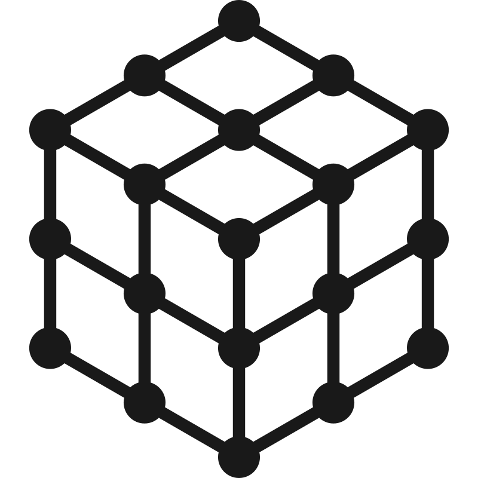

<h1>

Threefy
</h1>


## Overview
**Threefy** is a lightweight JavaScript library that brings [**three.js**](https://threejs.org/) into [**React**](https://react.dev/) as first-class declarative components. Describe a scene the way you describe a UI — as a tree of elements with props — and threefy handles the imperative object graph, the render loop, and the disposal for you.

The entire library ships as a single ES module with no bundled dependencies: react and three.js stay external, so you keep full control over your own versions and never pay for a duplicate copy of three.js.

## What's new in 2.1 — your components are real React components

Until now, threefy executed the components you wrote *inside their parent's render* in order to
discover the lowercase tags they returned. That worked, but it put your component's hooks on the
parent's fiber. Threefy 2.1 removes that: your components are rendered in their own place in the
React tree, and the tags they return are resolved there.

- **Conditional rendering works.** Returning different element types on different renders — early
  returns included — no longer trips React's `Rendered fewer hooks than expected` error.
- **`useFrame`, `useKeyDown` and `useKeyUp` can be called conditionally.** `if ( font ) useFrame(…)`
  is fine, and so is calling one of them twice, or after an early return. They register no React
  hooks of their own inside a threefy component — the wrapper around your component holds a fixed
  set of hooks and collects the callbacks — so the rules that trip up ordinary custom hooks do not
  apply to these three. Callbacks always see your latest props, are never registered twice, and are
  removed when the component unmounts or stops asking for them.
- **Unmounting really cleans up.** Objects removed from your tree are removed from the scene
  instead of lingering in it — and so are the things that used to linger invisibly: post-processing
  passes, effects, fog, and controls. GPU resources are released for the geometries and materials
  threefy created, and left alone for the objects you passed in yourself. **This now extends to the
  canvas itself:** unmounting `ThreeCanvas` stops the render loop, detaches every DOM listener,
  disposes the renderer, and removes the canvas element from the page. Mounting it again starts
  fresh. (React `StrictMode`'s double mount is recognised and does not tear the canvas down.)
- **`<Suspense>` behaves the way React means it.** `useLoader` suspends while a model is in flight,
  so a boundary's fallback is shown during loading and disappears on its own once the models
  arrive. Everything inside a boundary appears together, whichever file finished first — wrap a
  slow model in its own boundary to let the rest through. A boundary is optional: `ThreeCanvas`
  provides one, so loading a model still takes no setup. A file that cannot be loaded raises an
  error your boundary can catch, instead of leaving the fallback on screen forever — and
  `retryLoad( url )` reopens it, so a "try again" button is one call.
- **Files from the user's own machine.** `openFiles()` puts a file picker on the canvas and
  `dragDropFiles()` accepts files dropped onto it — both read the common 3D formats and add the
  result to the scene, or hand it to you if you would rather place it yourself. Each returns a
  function that removes it again.
- **`memo` and `forwardRef` work**, and your components appear in React DevTools under their own
  names. Error boundaries and effect cleanup follow the component that owns them.
- **Pointer testing costs only what you use.** Threefy no longer casts a ray through the scene on
  every mouse move unless something needs the result — a hover handler, an outline pass, or a
  transform gizmo. Presses always cast — that is where picking is decided — and `pickable={false}`
  takes an object that is expensive to test, such as a thousand-instance skinned mesh, out of the
  test entirely.
- **As many canvases as you like, wherever you want them.** `ThreeCanvas` now renders its own
  element, so you place and size it with ordinary CSS — in a flex cell, a grid, a sidebar — and each
  one owns its scene, camera, controls and renderer. It follows the size of the box you put it in;
  give it `width` and `height` to pin it instead. Unmounting one leaves the others untouched.
  ```jsx
  <div style={{ display: 'flex', gap: 12, height: '70vh' }}>
    <div style={{ flex: 2 }}><ThreeCanvas>{ /* … */ }</ThreeCanvas></div>
    <ThreeCanvas width={320} height={240}>{ /* … */ }</ThreeCanvas>
  </div>
  ```
- **Still no build configuration.** Lowercase tags are resolved at render time, so there is nothing
  to add to your bundler config.

Two rules follow from rendering your components normally:

- **Define components at module top level**, not inside another component's body. A component
  redefined on every render is a different component to React and gets remounted — rebuilding the
  three.js objects underneath. Threefy warns in the console when it sees this.
- **Use function components.** Class components are not supported inside the threefy tree.

## What's new in 2.0 — WebGPU

Threefy 2.0 is a ground-up migration to **`WebGPURenderer`**, the modern rendering engine of three.js. This is not a compatibility shim — the whole library was rewritten against the WebGPU stack, so the renderer's capabilities are available to you directly and idiomatically.

- **Modern GPU pipeline.** Rendering runs on WebGPU, with its explicit pipeline state, lower CPU driver overhead, and support for compute-based workloads on the GPU.
- **Automatic WebGL 2 fallback.** `WebGPURenderer` transparently falls back to a WebGL 2 backend on browsers or devices without WebGPU. The same application code runs everywhere — you write it once.
- **Node materials, as JSX.** The full node material family is registered as elements — `<meshStandardNodeMaterial/>`, `<meshPhysicalNodeMaterial/>`, `<spriteNodeMaterial/>` and more — so you can attach TSL nodes (`colorNode`, `positionNode`, `normalNode`, `fragmentNode`, …) straight from your component tree.
- **TSL instead of GLSL.** Shading is authored in **Three.js Shading Language**, a composable JavaScript API that compiles to WGSL on WebGPU and to GLSL on the WebGL 2 fallback. One shader, both backends.
- **A rebuilt post-processing pipeline.** Effects are driven by the node-based `RenderPipeline`. Bloom, ground-truth ambient occlusion, outline, depth of field, FXAA, dot-screen, RGB shift, glitch, anaglyph, parallax-barrier, stereo and ASCII are all provided as drop-in passes and effects.
- **Instancing that scales.** `InstancedObject` renders a whole multi-mesh model as instances that share a single matrix and color buffer, and `InstancedSkinnedMesh` gives every instance its own animated skeleton through a TSL skinning path.

Because threefy imports `three/webgpu` directly, no bundler aliases or build configuration are required on your side.

## Requirements
| Package | Version |
| --- | --- |
| `react` / `react-dom` | `>= 19.1` |
| `three` | `>= 0.185` |

## Installation
Install threefy alongside its peer dependencies:
```sh
npm install threefy three react react-dom
```
Then import it into your React project:
```js
import * as Threefy from 'threefy'
```
That's it — no renderer setup, no configuration. You're ready to build.

## Basic Usage

The first example creates a 3D scene from elements; the second updates a mesh through ordinary React state and hooks. If no camera or scene is declared — as in the second example — threefy inserts sensible defaults for you. All 3D elements must live inside a **`ThreeCanvas`**.

#### 1) Creating 3D elements
```jsx
import { createRoot } from 'react-dom/client'
import * as Threefy from 'threefy'

createRoot(document.getElementById('root')).render(
  <Threefy.ThreeCanvas>
    <perspectiveCamera args={[ 60, 1.23, 0.1, 1000 ]} position={[ 0, 0, 50 ]}/>
    <scene>
      <ambientLight args={[ 0xffffff, 0.5 ]}/>
      <directionalLight args={[ 0xffffff, 1 ]} position={[ 1, 2, 3 ]}/>
      <mesh>
        <boxGeometry args={[ 20, 20, 20 ]}/>
        <meshStandardMaterial color={'yellow'}/>
      </mesh>
    </scene>
  </Threefy.ThreeCanvas>
)
```

#### 2) Updating a created 3D element
```jsx
import { useRef, useState } from 'react'
import { createRoot } from 'react-dom/client'
import { ThreeCanvas, useFrame } from 'threefy'

const DemoHoverClick = () =>
{
  const ref = useRef(null)
  const [ index, setIndex ] = useState( 0 )
  const [ hovered, setHovered ] = useState( false )

  const sizes = [ 7, 10, 13, 16 ]
  const colors = [ 'red', 'green', 'blue', 'yellow' ]
  const size = sizes[ index ]
  const color = hovered ? colors[ index ] : 'white'

  useFrame( t => { if( ref.current ) ref.current.rotation.y = t } )

  return (
    <mesh
      ref={ref}
      onClick={() => setIndex( (index + 1) % 4 )}
      onPointerOver={() => setHovered(true)}
      onPointerOut={() => setHovered(false)}
    >
      <boxGeometry args={[size, size, size]}/>
      <meshStandardMaterial color={color}/>
    </mesh>
  )
}

createRoot(document.getElementById('root')).render(
  <ThreeCanvas>
    <threePointLighting/>
    <DemoHoverClick/>
  </ThreeCanvas>
)
```

#### 3) Shading with TSL
Node materials accept TSL nodes as props, so custom shading stays inside your component tree — no string shaders, no `onBeforeCompile`.

```jsx
import { createRoot } from 'react-dom/client'
import { ThreeCanvas } from 'threefy'
import { positionLocal, sin, time, vec3 } from 'three/tsl'

const PulsingBox = () => (
  <mesh>
    <boxGeometry args={[ 20, 20, 20 ]}/>
    <meshStandardNodeMaterial
      colorNode={vec3( sin( time ).mul(0.5).add(0.5), 0.4, 1 )}
      positionNode={positionLocal.mul( sin( time ).mul(0.05).add(1) )}
    />
  </mesh>
)

createRoot(document.getElementById('root')).render(
  <ThreeCanvas>
    <threePointLighting/>
    <PulsingBox/>
  </ThreeCanvas>
)
```

## Features
- **Seamless React integration.** Scenes are component trees. Props drive the three.js object graph, refs give you the real objects, and unmounting cleans up after itself.
- **Powered by the three.js WebGPU renderer.** The modern rendering path, with automatic WebGL 2 fallback for wide reach.
- **Concise, readable syntax.** Elements, props and hooks replace boilerplate setup for geometries, materials, lights, controls and animation.
- **Shade with TSL, in JSX.** The whole node-material family is registered as elements, so `colorNode`, `positionNode`, `normalNode` and the rest are ordinary props — no separate material plumbing, no GLSL strings.
- **Pointer events on 3D objects.** `onClick`, `onPointerOver`, `onPointerMove` and the rest work on meshes, on a single instance of an instanced mesh, and on an individual point of a point cloud. `pickable={false}` keeps an expensive object out of the test.
- **Loading is asynchronous by default.** `useLoader` suspends while files are in flight, so `<Suspense>` fallbacks behave the way React means them — and a boundary is optional, since `ThreeCanvas` provides one.
- **Batteries included.** Loaders for the common 3D formats — from a URL, or from the user's own machine through a file picker or drag and drop — exporters, nine camera and object controls, post-processing passes and camera effects, animation playback, instancing helpers, sprite-based point clouds and procedural nature objects.
- **Built for performance.** Instanced and batched rendering, merged materials backed by texture atlases, a render loop tuned to keep the GPU from falling behind, and pointer testing that costs nothing until something actually needs it.
- **Small and unobtrusive.** One ES module, no bundled dependencies, no runtime configuration — and no bundler setup, since lowercase tags are resolved at render time.

## Migrating from 1.x
Version 2.0 is a major release. If you are upgrading an existing 1.x project:

- **Peer dependencies.** three.js `>= 0.185` and React `>= 19.1` are now required.
- **`composer` → `pipeline`.** The post-processing entry point is now the node-based `ThreefyPipeline`, exposed as `pipeline`.
- **`clock` → `timer`.** `THREE.Clock` was replaced by `THREE.Timer`.
- **`rgbeLoader` → `hdrLoader`.** Renamed to match the underlying `HDRLoader`.
- **Conversion helpers renamed** to verb form: `THREE_Color` → `toColor`, `THREE_Vector3` → `toVector3`, and `THREE_Vector2s` / `THREE_Vector3s` / `THREE_Vector4s` → `toVector2s` / `toVector3s` / `toVector4s`.
- **Raw shaders are gone.** `ShaderMaterial` and `RawShaderMaterial` have no equivalent under the WebGPU renderer. Port GLSL shaders to TSL node materials.
- **The `.js` / `.json` model format is no longer read or written** (2.1). It was three.js's own object format; loading it never actually reached the scene, so nothing that worked before stops working. Use `.glb` for the same round trip — `useExporter( 'scene.glb', object )` and `useLoader( 'scene.glb' )`.

### Coming from 2.0
Three changes can be noticed by existing code:

- **`ThreeCanvas` renders an element.** The canvas used to be appended to `document.body`, outside your React tree; it now lives inside the element `ThreeCanvas` renders, so your own CSS finally applies to it. If your canvas was sized by the window and its container gives it no height, it keeps filling the window as before.
- **Several `<ThreeCanvas>` tags now mean several canvases.** Until 2.0 the renderer was a module-wide singleton, so repeating the tag silently folded into one canvas. That was a side effect, not a feature. To assemble one scene from several pieces, use ordinary components and `<group>` — no extra `ThreeCanvas` needed. Nesting one inside another is almost certainly a mistake and is now reported in the console.
- **A texture that fails to load is no longer cached.** The next request retries instead of returning the same empty texture forever, and `threefy.loadTexture( url, onLoad, onError )` reports the failure. An empty URL now means "no texture" and is not requested at all — convenient when the URLs come from a config object with unused slots.

## Documentation
For a full API reference and many more examples, see the [threefy documentation](https://nova-graphix.gitbook.io/threefy).

## Contact
Questions, bug reports, and suggestions are welcome — open an [issue](https://github.com/nova-graphix/threefy/issues) or contact us at **info@nova-graphix.com**.
- Website: https://www.nova-graphix.com
- LinkedIn: https://www.linkedin.com/company/novagraphix/
- Facebook: https://www.facebook.com/NovaGraphixCo
- YouTube: https://www.youtube.com/@3D-novagraphix

## License
This project is licensed under the MIT License.
